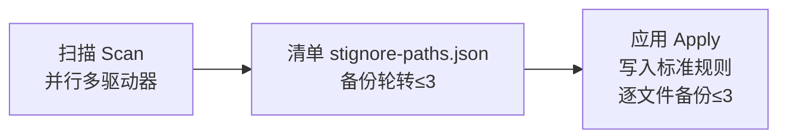

# Syncthing 忽略模式

> 精心整理的开箱即用 `.stignore` 规则集，自动排除系统文件、缓存、构建产物与应用数据，让 Syncthing 同步更干净高效。


[中文](#中文说明) | [English](README_EN.md)

---

## 中文说明

### 目录

- [特性](#特性)
- [通配符语法](#通配符语法)
- [已包含的分类](#已包含的分类)
- [使用方法](#使用方法)
- [示例](#示例)
- [开源许可](#开源许可)

### 特性

- ✅ **12 大分类**覆盖系统、缓存、构建产物、数据库等常见噪音文件
- ✅ **开箱即用** — 直接复制即可生效，无需额外配置
- ✅ **中英双语文档**，方便团队协作
- ✅ **持续维护**，随生态更新规则

### 通配符语法

| 模式 | 说明 |
|------|------|
| `(?d)` | 删除阻止目录时允许删除文件 |
| `(?i)` | 忽略大小写匹配 |
| `!` | 取反（包含此模式） |
| `*` | 单级通配符 |
| `**` | 多级通配符 |
| `//` | 注释 |

### 已包含的分类

`.stignore` 文件按以下 16 个分类组织（完整内容请查看文件本身）：

1. **系统与 OS 文件** — `$RECYCLE.BIN`、`.DS_Store`、`Thumbs.db`、`desktop.ini`、`pagefile.sys`、`Program Files/`、`System Volume Information/`、`LOST.DIR/` 等
2. **数据库文件** — `#innodb_redo`、`#innodb_temp`、`ibdata1`、`*.ibd`、`pg_wal/`、`*.sqlite3`、`mongod.lock`、`dump.rdb` 等
3. **备份与临时文件** — `.cache`、`.tmp`、`.delete`、`Temp/`、`Backup_of_*` 等
4. **应用数据与缓存** — `.stfolder/`、`.stversions`、`.dropbox.cache/`、`WeChat Files/`、`Tencent Files/`、`BaiduNetdiskDownload/`、`AliWorkbenchData/`、`Youku Files/`、`SteamLibrary/` 等
5. **版本控制系统** — `.git/`
6. **包管理器缓存与依赖** — `node_modules/`、`.npm/`、`.pnpm-store/`、`.venv/`、`__pycache__/`、`.cargo/`、`.gradle/`、`.m2/`、`.nuget/`、`.bun/`、`.deno/`、`.dart_tool/`、`vendor/` 等
7. **前端框架构建缓存** — `.next/`、`.nuxt/`、`.svelte-kit/`、`.vite/`、`.turbo/`、`.astro/`、`.docusaurus/`、`.parcel-cache/`、`.vercel/`、`.netlify/`、`.vuepress/dist/` 等
8. **Python 与测试缓存** — `.pytest_cache/`、`.mypy_cache/`、`.ruff_cache/`、`.coverage`、`.jest-cache/`、`.vitest/`、`.tox/`、`.nox/`、`.ipynb_checkpoints/`、`htmlcov/` 等
9. **C/C++ 与 Rust 构建缓存** — `CMakeCache.txt`、`CMakeFiles/`、`cmake-build-debug/`、`cmake-build-release/`、`compile_commands.json`、`.ccls-cache/`、`.clangd/`、`.rustc_cache/` 等
10. **JVM 与 Scala 构建缓存** — `.ammonite/`、`.bloop/`、`.metals/`、`.kotlintest/`
11. **IDE 与工具缓存** — `.idea/`、`.history/`、`.terraform/`、`.terraform.lock.hcl`、`.terragrunt-cache/`、`.helm/`、`.kube/`、`.flyway/` 等
12. **编辑器与开发工具缓存** — `.vscode/`（保留 `settings.json`）、`.vim/`、`.swp`、`*~`、`.emacs.d/`、`.sublime-*`、`.zed/`、`.cursor/` 等
13. **压缩包与分卷下载** — `*.part`、`*.aria2`、`*.crdownload`、`/downloading/` 等
14. **虚拟化与容器文件** — `*.vmdk`、`*.qcow2`、`*.ova`、`.docker/`、`.minikube/`、`.vagrant/` 等
15. **媒体与播放器缓存** — `.cache/`、`Spotify/`、`GPUCache/`、`Service Worker/`、`Spotlight-V100/`、`.Trashes/` 等
16. **锁文件与日志文件** — `*.lock`、`*.log.*`、`**.log`

### 使用方法

#### 前置条件

- 已安装并运行的 [Syncthing](https://syncthing.net/) 实例
- 至少配置了一个同步文件夹

#### 方法一：直接复制文件

1. 从本仓库下载 `.stignore` 文件
2. 将其放置在 Syncthing 同步文件夹的**根目录**
3. 重启 Syncthing 或触发重新扫描 — 模式将在下次扫描时生效

#### 方法二：通过 Syncthing Web 界面

1. 打开 Syncthing Web 界面（默认地址：`http://localhost:8384`）
2. 点击目标文件夹 → **编辑** → **忽略模式（Ignore Patterns）**
3. 将 `.stignore` 内容粘贴到编辑框中
4. 点击 **保存** — 模式立即生效并触发重新扫描

#### 方法三：引入外部文件

Syncthing 支持 `// #include` 指令，可将模式拆分到多个文件中：

```text
// 引入本仓库的模式
#include .stignore-base

// 在下方添加您的自定义规则
**/my-secret-folder
*.local
```

#### 自定义建议

- **白名单**：使用 `!` 重新包含模式，例如 `!**/.git/` 可让 `.git` 文件夹继续同步
- **忽略大小写**：使用 `(?i)` 前缀，例如 `(?i)**.jpg` 可匹配 `.JPG`、`.jpg`、`.Jpg`
- **安全删除**：使用 `(?d)` 前缀，允许在父目录被删除时同步删除文件
- **注释**：以 `//` 开头的行会被忽略，可用于规则说明
- **提交前测试**：在 Web 界面的"忽略模式"预览中验证哪些文件被匹配

#### 验证生效

应用模式后：

1. 打开 Syncthing Web 界面 → 文件夹 → **忽略模式** 确认规则已加载
2. 检查文件夹状态 — 匹配模式的文件不应再出现在同步队列中
3. 使用 **最近更改** 验证被忽略的文件未被同步

### 示例

```text
// 递归排除回收站
**$RECYCLE.BIN

// macOS 系统文件
**.DS_Store

// node_modules
**/node_modules/*

// 忽略大小写匹配
(?i)**.JPG

// 白名单 .git 文件夹
!**/.git/
```

### 批量同步工具

仓库附带的工具可将标准 `.stignore` 规则批量应用到电脑中所有 Syncthing 同步目录，**无需每次全盘扫描**。

#### 图形界面（推荐）

`SyncthingIgnoreGUI.ps1` 是一个 WinForms 图形界面，集成「扫描」与「应用」两大功能，支持**中英文一键切换**（左上角语言下拉框，默认跟随系统区域），操作更直观：

```powershell
# 推荐：脚本自动检测并以 STA 线程重启自身（WinForms 必需）
.\SyncthingIgnoreGUI.ps1

# 或显式指定 STA（等价）
powershell -STA -NoProfile -File .\SyncthingIgnoreGUI.ps1
```

界面功能：

| 功能 | 说明 |
|------|------|
| 语言切换 | 左上角下拉框选择 `English` / `中文`，实时切换全部界面文字与日志；选择记忆到 `config.json`；中文文案以 `\u` 转义内嵌，脚本保持纯 ASCII |
| 主题切换 | 左上角下拉框选择 `浅色` / `深色`，即时换肤，选择同样持久化；深色模式下降级 3D 边框为单线避免亮边 |
| 扫描根目录 | 留空扫描所有固定驱动器，或点击 `浏览...` 选择指定目录；支持将文件夹/`.stignore` 拖拽到窗口自动填充 |
| 并行扫描 | runspace 线程池（最多 4 线程）+ `-Filter .stignore`，扫描速度显著提升 |
| 清单输出路径 | 默认 `stignore-paths.json`，可自定义 |
| 仅预览 | 勾选后仅预览，不写入任何文件 |
| 强制 | 勾选后跳过逐文件确认直接执行 |
| 写回清单前备份 | 勾选后在写回清单前备份原清单 |
| 实时日志 | 底部日志框输出全部执行信息（自动滚动到底），附「清空日志」按钮 |
| 后台应用 | Scan/Apply 均在后台 runspace 执行，GUI 不卡顿，进度条显示真实百分比与数字 |
| 结果列表 | 扫描/应用后结果显示在专属列表中，双击可打开对应文件 |
| 停止按钮 | 运行过程中点击「停止」强制中止后台 job，确保不再写入清单/文件 |
| 扫描摘要 | 窗体显示「已找到 N 个 .stignore 文件」；启动时自动加载已有清单数量 |
| 安全防护 | 非预览且非强制时，Apply 前弹出确认框，避免误写大量路径 |
| 关于 | 右上角「关于」显示版本与项目地址 |
| 版本与项目地址 | 窗口底部显示当前版本号（v1.14.0）与可点击项目主页链接 |

**工作流**



1. 默认直接点 **Scan** 即可扫描所有驱动器并生成 `stignore-paths.json`（如需先看结果再写文件，可勾选 `仅预览`）
2. 规则有更新时，勾选 `强制` 点 **Apply** 即可同步所有历史路径

> 说明：清单 `stignore-paths.json` 记录每条 `.stignore` 的路径、大小与修改时间；规则一致的文件自动跳过，不会重复备份。失效路径（文件已删除）需勾选 `强制` 才会从清单清理。

#### 使用方式

工具为**单一自包含脚本** `SyncthingIgnoreGUI.ps1`，扫描与应用逻辑均已内联，无需额外依赖：

```powershell
# 推荐：脚本自动检测并以 STA 线程重启自身（WinForms 必需）
.\SyncthingIgnoreGUI.ps1

# 或显式指定 STA（等价）
powershell -STA -NoProfile -File .\SyncthingIgnoreGUI.ps1
```

**界面布局**

```mermaid
flowchart TD
    TITLE[标题: Syncthing .stignore 管理器]
    TOP[语言: EN / 中文 ▼   主题: 浅色 / 深色 ▼]
    TITLE --- TOP
    TOP --- ROW1[扫描根目录: [_____] [浏览...]]
    ROW1 --- ROW2[清单输出: [stignore-paths.json] [浏览...]]
    ROW2 --- ROW3[☑ 仅预览  ☑ 强制  ☑ 写回前备份]
    ROW3 --- BTN[Scan | Apply | 打开清单 | 清空日志 | 停止 | 关于]
    BTN --- SUM[扫描摘要]
    SUM --- LST[结果列表（双击打开文件）]
    LST --- LOG[日志框]
    LOG --- PROG[进度条 + 百分比]
    PROG --- STATUS[状态栏: v1.14.0 | 项目主页链接]
```

```
┌──────────────────────────────────────────────────────┐
│ 语言:[EN ▼]   主题:[浅色 ▼]   Syncthing .stignore 管理器│
├──────────────────────────────────────────────────────┤
│ 扫描根目录（留空=所有固定驱动器）: [__________][浏览]   │
│ 清单输出路径: [stignore-paths.json    ][浏览]         │
│ ☑ 仅预览   ☑ 强制   ☑ 写回前备份                      │
│                                                        │
│ [Scan] [Apply] [打开清单] [清空日志] [停止] [关于]    │
│ 已找到 N 个 .stignore 文件                            │
│ 结果列表:                                              │
│ [_________________ 扫描结果 _____________________]    │
│ 日志:                                                 │
│ [_________________ 实时日志输出 _________________]    │
│ [==========进度==========] 100%                       │
├──────────────────────────────────────────────────────┤
│ v1.14.0 | SyncthingIgnorePatterns   🔗 项目地址        │
└──────────────────────────────────────────────────────┘
```

> 说明：以上为界面对应区域示意。实际界面文案随语言切换（EN/中文）实时变化；所有中文以 `\u` 转义存储，脚本文件保持纯 ASCII 不会被编码破坏。

**备份轮转**：每次替换 `.stignore` 产生的 `*.bak.<时间戳>` 与清单备份 `stignore-paths.json.bak.<时间戳>`，均**最多保留 3 个**，超出的自动删除最旧的备份，避免备份文件无限堆积。

### 开源许可

本项目基于 [MIT 许可证](https://opensource.org/licenses/MIT) 开源。
