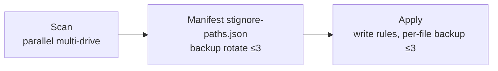

# Syncthing Ignore Patterns

> A curated, ready-to-use `.stignore` rule set: 20 categories · 287 patterns that exclude system files, caches, build artifacts, and app data.


[English](#english) | [中文](README.md)

---

## English

- ✅ **20 categories / 287 patterns** covering system files, caches, build artifacts, databases, and more
- ✅ **Zero-config**: drop it at the sync folder root and it works
- ✅ **Bilingual docs** plus a batch-sync GUI tool
- ✅ **Actively maintained** as the ecosystem evolves

> The `Updated` date in the `.stignore` header (`2026-08-31`) is the ruleset revision date; the tool release version lives in CHANGELOG (currently `v1.17.2`). One tracks "ruleset revision", the other "tool release" — they may differ and that is expected.

### Quick Start

1. Download `.stignore` and place it at the **root** of your Syncthing sync folder
2. Restart Syncthing or trigger a rescan — patterns take effect on the next scan

You can also paste the contents into the Web UI (default `http://localhost:8384`) → folder → **Edit** → **Ignore Patterns** and save; it applies immediately.

To split patterns across files, use `// #include`:

```text
#include .stignore-base
// Your custom rules below
**/my-secret-folder
*.local
```

### Pattern Syntax

| Pattern | Description |
|---------|-------------|
| `(?d)` | Allow deletion when the blocked parent dir is removed |
| `(?i)` | Case-insensitive matching |
| `!` | Negation (re-include) |
| `*` / `**` | Single-level / multi-level wildcard |
| `//` | Comment |

### Categories

See the `.stignore` file for the full rule set:

| # | Category | Typical patterns |
|---|----------|------------------|
| 1 | System & OS Files | `$RECYCLE.BIN/`, `.DS_Store`, `Thumbs.db`, `desktop.ini`, `System Volume Information/` |
| 2 | Database Files | `ibdata1`, `*.ibd`, `pg_wal/`, `*.sqlite3`, `*.db-wal` (no blanket `*.db`) |
| 3 | Backup & Temp Files | `*.tmp`, `*.bak`, `.delete/`, `Backup_of_*`, `.stignore.bak.*` |
| 4 | App Data & Caches | `.dropbox.cache/`, `WeChat Files/`, `BaiduNetdiskDownload/`, `SteamLibrary/` (keeps `.stfolder/`, `.stversions`) |
| 5 | Version Control | `.git/`, `.svn/`, `.hg/` |
| 6 | Package Manager Caches | `node_modules/`, `.npm/`, `.venv/`, `.cargo/`, `.gradle/`, `.m2/`, `vendor/` |
| 7 | Frontend Build Caches | `.next/`, `.nuxt/`, `.svelte-kit/`, `.vite/`, `.turbo/`, `.vercel/` |
| 8 | Python & Test Caches | `.pytest_cache/`, `.mypy_cache/`, `.ruff_cache/`, `.tox/`, `.ipynb_checkpoints/` |
| 9 | C/C++ & Rust Builds | `CMakeCache.txt`, `CMakeFiles/`, `cmake-build-*/`, `.clangd/` |
| 10 | JVM & Scala Builds | `.bloop/`, `.metals/`, `.scala-build/`, `.mvn/` |
| 11 | IDE & Tool Caches | `.idea/`, `.history/`, `.terraform/`, `.terragrunt-cache/`, `.helm/`, `.kube/` |
| 12 | Editors & Dev Tools | `.vscode/` (keeps `settings.json`), `.vim/`, `*.swp`, `*~`, `.cursor/` |
| 13 | Archives & Partial Downloads | `*.part`, `*.aria2`, `*.crdownload`, `downloading/` |
| 14 | Virtualization & Containers | `*.vmdk`, `*.qcow2`, `*.ova`, `.docker/`, `.vagrant/` |
| 15 | Media & Player Caches | `Spotify/`, `iTunes/Album Artwork/`, `PotPlayerMini*`, `.Spotlight-V100/` |
| 16 | Lock & Log Files | `*.lock` (re-includes `Cargo.lock`, `package-lock.json`, `yarn.lock`), `*.log`, `nohup.out` |
| 17 | Build Artifacts | `target/`, `dist/`, `build/`, `bin/`, `obj/`, `*.pyc`, `*.class`, `*.o` |
| 18 | Cache & Temp Directories | `(?i)**/cache/`, `temp/`, `tmp/`, `.cache/`, `thumbnails/`, `.eslintcache` |
| 19 | Browser & Electron Caches | `Code Cache/`, `GPUCache/`, `ShaderCache/`, `IndexedDB/`, `blob_storage/` |
| 20 | OS Temp & Cache Locations | `/tmp/`, `/var/tmp/`, `/var/cache/`, `/Windows/Temp/` (root-anchored) |

> Heads-up 1: `dist/`, `build/`, `bin/`, `target/`, `cache/`, `temp/` in categories 17–18 are generic names. If you need to sync a folder with one of those names, delete the matching line.
> Heads-up 2: category 18 uses `(?i)` for case-insensitive matching and matches **whole directory names only**, so `MyCacheFolder/`, `Template/` and `Tempura/` are safe.

### Customization Tips

```text
!**/.git/          // whitelist: keep .git in sync
(?i)**.jpg         // case-insensitive
(?d)**/temp/**     // allow deletion with parent dir
```

Use the "Ignore Patterns" preview in the Web UI to verify matches before saving.

### Batch Sync Tool

`SyncthingIgnoreGUI.ps1` is a single self-contained WinForms script that applies the standard rules to every Syncthing folder on the machine — **without scanning the whole disk every time**:

```powershell
.\SyncthingIgnoreGUI.ps1                                   # auto-restarts on an STA thread (required by WinForms)
powershell -STA -NoProfile -File .\SyncthingIgnoreGUI.ps1   # equivalent
```

- **Language**: switch `English` / `中文` at the top-left; applies live and persists to `config.json` (Chinese stored as `\u` escapes, script stays pure ASCII)
- **Theme**: `Light` / `Dark`, instant and persisted
- **Scan**: runspace pool (≤4 threads) with `-Filter .stignore`; leave the root blank to scan all fixed drives, or drag & drop a folder
- **Options**: `Preview` (write nothing), `Force` (skip per-file confirmation), `Back up manifest`
- **Manifest**: defaults to `config/stignore-paths.json`, storing path/size/mtime; already-matching files are skipped, stale paths are cleaned only with `Force`
- **Live status**: while scanning, the status line shows roots done, files found, the **directory currently being scanned** and elapsed time; results stream in as they are found (a single root switches the bar to marquee mode instead of a fake percentage)
- **More**: background execution keeps the UI responsive, double-click a result to open it, **Stop** aborts the background job, and the status bar shows the version plus a project link



**Backup rotation**: `.stignore.bak.<timestamp>` and `stignore-paths.json.bak.<timestamp>` each keep **at most 3** copies — older ones are deleted automatically.

### Contributing

- [Contributing Guide](.github/CONTRIBUTING.md) — ruleset conventions, architecture red lines, and PR workflow
- [Code of Conduct](.github/CODE_OF_CONDUCT.md) · [Security Policy](.github/SECURITY.md) · [Support](.github/SUPPORT.md)

### License

Released under the [MIT License](https://opensource.org/licenses/MIT).
