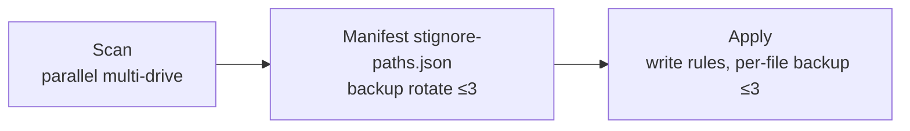

# Syncthing Ignore Patterns

> A curated, ready-to-use `.stignore` rule set that automatically excludes system files, caches, build artifacts, and app data — keeping your Syncthing sync clean and efficient.


[English](#english) | [中文](README.md)

---

## English

### Table of Contents

- [Features](#features)
- [Pattern Syntax](#pattern-syntax)
- [Included Categories](#included-categories)
- [Usage](#usage)
- [Examples](#examples)
- [License](#license)

### Features

- ✅ **12 categories** covering common noise — system, caches, build artifacts, databases, and more
- ✅ **Zero-config** — copy and it just works, no extra setup required
- ✅ **Bilingual docs** (English & Chinese) for smoother team collaboration
- ✅ **Actively maintained** as the ecosystem evolves

### Pattern Syntax

| Pattern | Description |
|---------|-------------|
| `(?d)` | Allow deletion when blocked parent dir is removed |
| `(?i)` | Case-insensitive matching |
| `!` | Negation (include this pattern) |
| `*` | Single-level wildcard |
| `**` | Multi-level wildcard |
| `//` | Comment |

### Included Categories

The `.stignore` file is organized into the following 16 categories (see the file for full details):

1. **System & OS Files** — `$RECYCLE.BIN`, `.DS_Store`, `Thumbs.db`, `desktop.ini`, `pagefile.sys`, `Program Files/`, `System Volume Information/`, `LOST.DIR/`, etc.
2. **Database Files** — `#innodb_redo`, `#innodb_temp`, `ibdata1`, `*.ibd`, `pg_wal/`, `*.sqlite3`, `mongod.lock`, `dump.rdb`, etc.
3. **Backup & Temporary Files** — `.cache`, `.tmp`, `.delete`, `Temp/`, `Backup_of_*`, etc.
4. **Application Data & Caches** — `.stfolder/`, `.stversions`, `.dropbox.cache/`, `WeChat Files/`, `Tencent Files/`, `BaiduNetdiskDownload/`, `AliWorkbenchData/`, `Youku Files/`, `SteamLibrary/`, etc.
5. **Version Control Systems** — `.git/`
6. **Package Manager Caches & Dependencies** — `node_modules/`, `.npm/`, `.pnpm-store/`, `.venv/`, `__pycache__/`, `.cargo/`, `.gradle/`, `.m2/`, `.nuget/`, `.bun/`, `.deno/`, `.dart_tool/`, `vendor/`, etc.
7. **Frontend Framework Build Caches** — `.next/`, `.nuxt/`, `.svelte-kit/`, `.vite/`, `.turbo/`, `.astro/`, `.docusaurus/`, `.parcel-cache/`, `.vercel/`, `.netlify/`, `.vuepress/dist/`, etc.
8. **Python & Testing Caches** — `.pytest_cache/`, `.mypy_cache/`, `.ruff_cache/`, `.coverage`, `.jest-cache/`, `.vitest/`, `.tox/`, `.nox/`, `.ipynb_checkpoints/`, `htmlcov/`, etc.
9. **C/C++ & Rust Build Caches** — `CMakeCache.txt`, `CMakeFiles/`, `cmake-build-debug/`, `cmake-build-release/`, `compile_commands.json`, `.ccls-cache/`, `.clangd/`, `.rustc_cache/`, etc.
10. **JVM & Scala Build Caches** — `.ammonite/`, `.bloop/`, `.metals/`, `.kotlintest/`
11. **IDE & Tool Caches** — `.idea/`, `.history/`, `.terraform/`, `.terraform.lock.hcl`, `.terragrunt-cache/`, `.helm/`, `.kube/`, `.flyway/`, etc.
12. **Editor & Dev Tool Caches** — `.vscode/` (keeps `settings.json`), `.vim/`, `.swp`, `*~`, `.emacs.d/`, `.sublime-*`, `.zed/`, `.cursor/`, etc.
13. **Archives & Partial Downloads** — `*.part`, `*.aria2`, `*.crdownload`, `/downloading/`, etc.
14. **Virtualization & Container Files** — `*.vmdk`, `*.qcow2`, `*.ova`, `.docker/`, `.minikube/`, `.vagrant/`, etc.
15. **Media & Player Caches** — `.cache/`, `Spotify/`, `GPUCache/`, `Service Worker/`, `Spotlight-V100/`, `.Trashes/`, etc.
16. **Lock & Log Files** — `*.lock`, `*.log.*`, `**.log`

### Usage

#### Prerequisites

- A running [Syncthing](https://syncthing.net/) instance
- At least one configured sync folder

#### Method 1: Copy the file directly

1. Download `.stignore` from this repository
2. Place it at the **root** of your Syncthing sync folder
3. Restart Syncthing or trigger a rescan — patterns take effect on the next scan

#### Method 2: Use the Syncthing Web GUI

1. Open the Syncthing Web UI (default: `http://localhost:8384`)
2. Click the target folder → **Edit** → **Ignore Patterns**
3. Paste the contents of `.stignore` into the editor
4. Click **Save** — patterns apply immediately and a rescan is triggered

#### Method 3: Include external files

Syncthing supports `// #include` directives to split patterns across files:

```text
// Include this repo's patterns
#include .stignore-base

// Add your own custom rules below
**/my-secret-folder
*.local
```

#### Customization Tips

- **Whitelist files**: Use `!` to re-include patterns, e.g. `!**/.git/` keeps `.git` folders in sync
- **Case-insensitive**: Prefix with `(?i)` to match across cases, e.g. `(?i)**.jpg` matches `.JPG`, `.jpg`, `.Jpg`
- **Safe deletion**: Use `(?d)` prefix to allow Syncthing to delete files when their parent directory is removed
- **Comments**: Lines starting with `//` are ignored — use them to document your rules
- **Test before committing**: Use the "Ignore Patterns" preview in the Web UI to verify which files are matched

#### Verification

After applying the patterns:

1. Open the Syncthing Web UI → folder → **Ignore Patterns** to confirm rules are loaded
2. Check the folder status — files matching the patterns should no longer appear in the sync queue
3. Use **Recent Changes** to verify ignored files are not being synced

### Examples

```text
// Recursively exclude Recycle Bin
**$RECYCLE.BIN

// macOS system files
**.DS_Store

// node_modules
**/node_modules/*

// Case-insensitive match
(?i)**.JPG

// Whitelist .git folders
!**/.git/
```

### Batch Sync Tool

The tool is a **single self-contained script**, `SyncthingIgnoreGUI.ps1`, which applies the standard `.stignore` rules to every Syncthing folder on your machine — **without scanning the whole disk every time**. Scan and apply logic is inlined; no external script dependencies. The GUI supports **English/Chinese switching** via the language box at the top-right (defaults to system locale); all UI text is stored as `\u` escapes in pure ASCII to avoid GBK re-encoding mojibake. Scanning uses a runspace thread pool (up to 4 threads) with a fast `-Filter .stignore` instead of `-Include`, greatly improving scan speed on multi-drive setups. A status bar shows the **current version** and a clickable **project homepage** link.

```powershell
# Launch the graphical tool
.\SyncthingIgnoreGUI.ps1
```

**Workflow**



1. By default, simply click **Scan** to scan all drives and generate `stignore-paths.json`. To see results before writing, check `Preview only` first.
2. Whenever `.stignore` is updated, check `Force` and click **Apply** to sync all recorded paths (originals are auto-backed up as `.stignore.bak.<timestamp>`).

**Options**

- `Preview only`: WhatIf mode — preview only, nothing written.
- `Force`: Skip per-file confirmation and execute directly.
- `Back up manifest`: Back up the manifest before writing it back.

> Note: the manifest `stignore-paths.json` records each `.stignore` path's size and modification time; files already matching the rules are skipped to avoid duplicate backups. Stale paths (deleted files) are cleaned from the manifest only when `Force` is checked.

**Backup rotation**: each replace produces a `.stignore.bak.<timestamp>`, and the manifest backup is `stignore-paths.json.bak.<timestamp>`. Both keep **at most 3** backups — older ones are deleted automatically to avoid unlimited growth.

### License

Released under the [MIT License](https://opensource.org/licenses/MIT).
