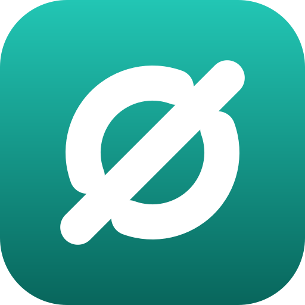

# 品牌资产（Brand Assets）

SyncthingIgnoreGUI 的视觉标识与使用规范。所有位图均由
[`tools/generate-brand-assets.ps1`](../../tools/generate-brand-assets.ps1) 生成
（纯 .NET，离线可跑），**请勿手工修改位图**。

## 标志含义



- **圆环（两段圆弧）**——同步循环，对应 Syncthing 的持续同步。
- **粗斜杠**——忽略 / 排除，对应 `.stignore` 忽略模式。
- **两处缺口**——斜杠恰好从缺口穿过，表达"同步循环被忽略规则截断"，
  也就是本工具做的事：在同步目录中扫描并写入忽略规则。

## 色板

| 名称 | 值 | 用途 |
|------|-----|------|
| Teal 500（渐变起） | `#22C6B4` | 标志底板渐变顶部 |
| Teal 800（渐变止） | `#08665C` | 标志底板渐变底部 |
| 白 | `#FFFFFF` | 标志图形（圆环 + 斜杠） |
| 应用主色种子 | `Colors.teal` | Flutter `colorSchemeSeed`（界面配色） |

渐变方向：垂直（自上而下）。

## 用法规范

- **最小尺寸**：16 × 16 px；`< 32 px` 时脚本自动简化为整环（不画缺口），保持清晰。
- **留白**：四周至少留出图标宽度的 1/4，不贴边、不叠加其它元素。
- **深色背景**：保留完整圆角底板；不要去掉底板只留白色图形（白色图形在浅色背景上不可见）。
- **不要**：改动渐变方向/颜色、加阴影或描边、拉伸为非正方形、叠加文字或其它图形。

## 资产清单

| 文件 | 尺寸 / 格式 | 用途 |
|------|-------------|------|
| `logo.svg` | 512 × 512 矢量 | 母版；文档与外部引用优先使用矢量 |
| `logo-512.png` | 512 × 512 PNG（透明圆角） | 高清位图、演示材料 |
| `logo-128.png` | 128 × 128 PNG | README、仓库图标、小尺寸位图 |
| [`app/windows/runner/resources/app_icon.ico`](../../app/windows/runner/resources/app_icon.ico) | 16/24/32/48/64/128/256 | Windows 应用图标；由 `runner.rc` 的 `IDI_APP_ICON` 引用并编译进 exe |

`.ico` 各帧为 PNG 压缩载荷（Vista+ 支持），整包约 17 KB。

## 再生成

```powershell
# 在仓库根目录执行
powershell -ExecutionPolicy Bypass -File tools/generate-brand-assets.ps1
```

脚本会覆盖 `logo-512.png`、`logo-128.png` 与 `app_icon.ico`。若要改色或改几何，
需同时更新 `logo.svg` 与本文件（矢量与文档为手工维护，须与脚本中的几何常量一致）。
